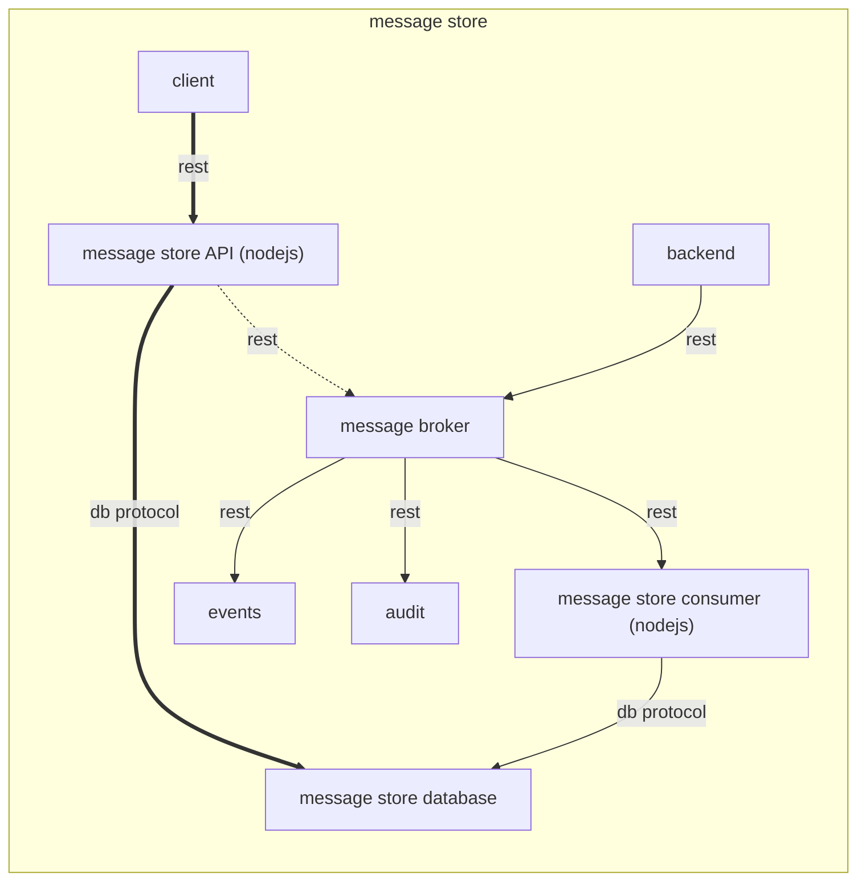

# Mexconsumer

*mexconsumer* è lo scodatore che si occupa dello scodamento dei messaggi "mex", che andranno poi ad essere salvati sul database.



## Getting Started

Per rendere operativo il sistema occorre:
1. creare lo schema sul database con lo script `dbscript/unpmex.sql`.
1. impostare gli opportuni valori delle variabili d'ambiente
1. editare il file di configurazione
1. avviare l'applicazione

### Prerequisites

* Istanza attiva di Postgres
* Componente Message broker attiva per leggere i messaggi e tracciare eventi 
* Componente Events attiva per inserire su db gli eventi generati (opzionale)

### Configuration

La configurazione è basata su variabili d'ambiente e file di configurazione. Una variabile può essere presente sia su variabile d'ambiente sia nel file di conf specifico dell'ambiente che nel file di conf generico della componente. All'avvio della comopnente viene effettuato il merge di questi tre entry point. Le variabili se prensenti in più punti (file o env) vengono gestite con la seguente priorità (dalla più alta alla più bassa):
* variabile d'ambiente
* file di conf specifico dell'ambiente
* file di conf generico della componente

Le variabili d'ambiente da valorizzare sono:
* `ENVIRONMENT`: rappresenta l'ambiente di esecuzione (ad esempio dev, tst o prod). Serve per individuare il file di configurazione secondario.

I file di configurazione sono `conf/pushconsumer.json` e`conf/pushconsumer-{ENVIRONMENT}.json`. Ove lo stesso parametro sia presente su entrambi i file il valore in `conf/preferences-{ENVIRONMENT}.json` ha la precedenza.

I principali attributi presenti nei file di configurazione sono elencati di seguito (per l'elenco completo visualizzare il contenuto dei file presenti nella cartella src/conf):

* `db`: contiene la configurazione per la connessione al database. 
    * `host`: l'hostname del dbms
    * `database`: il nome del database a cui accedere
    * `user`: utente con cui accedere al db
    * `password`: password dell'utente del db
    * `schema`: database schema
* `app_name` : nome dell'applicazione (obbligatorio per tracciatura degli eventi e check sicurezza)
* `mb`: contiene la configurazione per il Message Broker.
    * `queues`: contiene le informazioni per le code del message broker
        * `events`: url della coda su cui scrivere gli eventi
        * `messages`: url della coda su cui leggere i messaggi da inviare
    * `token`: il token auth per chiamare il message broker
* `security`: contiene la configurazione della sicurezza
    * `passphrase`: password per cifrare i dati sul db
* `log4js`: la configurazione di log4js (vedi https://www.npmjs.com/package/log4js)

## Running

Avviare mexconsumer
```
cd src && node mexconsumer.js
```

or

```
npm start
```

# Eventi
Il sistema registra su un message broker basato su api rest gli eventi relativi all'esecuzione. Vedi la componente [notify-events](https://github.com/csipiemonte/notify-events) per i dettagli sul formato degli eventi.

## Use case

Vedere file [docs/UseCase.md](https://github.com/csipiemonte/notify-messagebroker/blob/master/docs/UseCase.md) della componente **notify-messagebroker** per dettagli su come inviare una notifica sul message store a un utente.